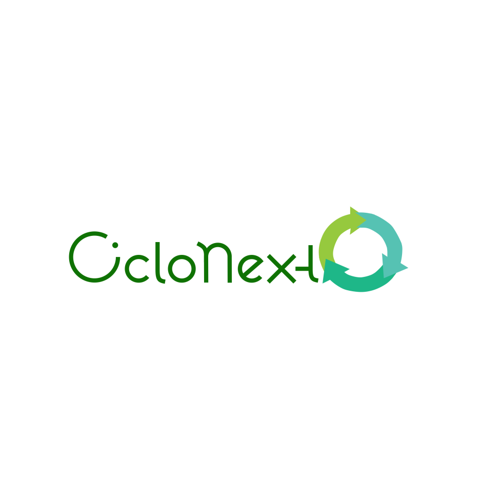

# CicloNext

# #Projeto CicloNext:

​	Projeto Integrador do bootcamp Generation Brasil Turma 24 - Grupo 2

Projeto de desenvolvimento de uma rede social, baseado nas ODS 12 da agenda 2030 da ONU - Consumo e Produção Sustentáveis. Uma rede social voltada para interação entre empresas, ONGs e interessados, criada para incentivar uma comunicação que promova a sustentabilidade, comprometimento com os recursos socioambientais, e buscar soluções para amenizar este problema.

A CicloNext promove a conexão entre entidades promovendo a doação de recursos reutilizáveis e a criação de uma rede de contatos voltada ao uso e reuso sustentável de recursos.

## #Integrantes:

* [Agda](https://github.com/agdaa)
* [Bruno](https://github.com/brunosequeira1)
* [Esdras](https://github.com/Esdrashx)
* [Jamily](https://github.com/JamilyM)
* [Joel](https://github.com/JoelRFJunior)
* [Wendew](https://github.com/wendewfranco)

